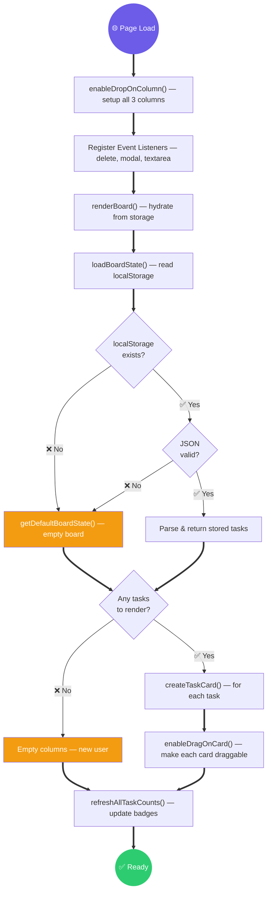
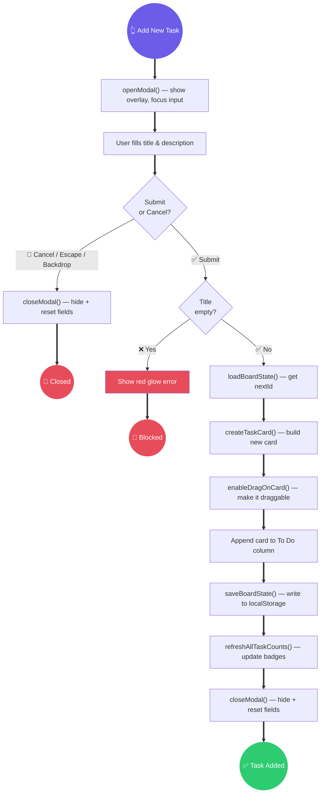
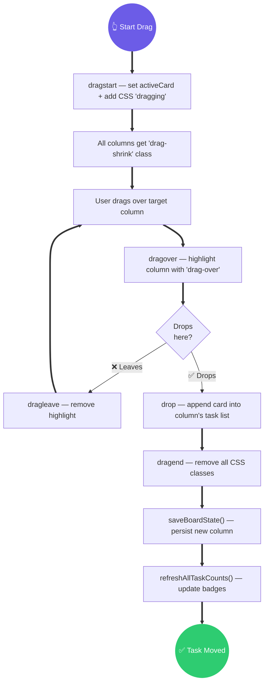
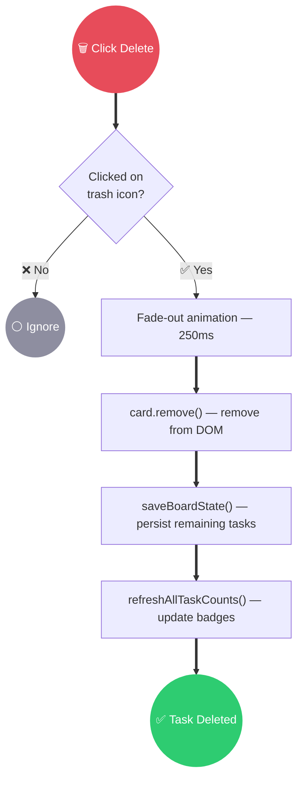
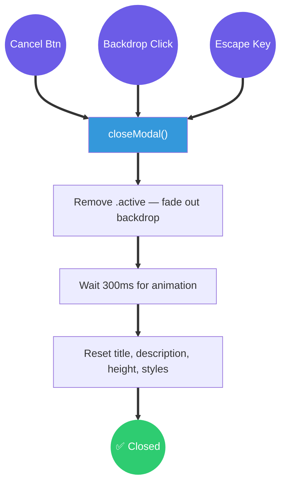

# 📊 index.js — Execution Flow

> Clean **waterfall-style** diagrams — read top-to-bottom, just like a DSA flowchart.

---

## 1️⃣ Page Load / Refresh

---

## 2️⃣ User Adds a New Task

---

## 3️⃣ User Moves a Task (Drag & Drop)

---

## 4️⃣ User Deletes a Task

---

## 5️⃣ Modal Close (3 Triggers)

---

## 📦 Function Reference

| Function                                              | Called By                                |
| ----------------------------------------------------- | ---------------------------------------- |
| `getDefaultBoardState()` — return empty board         | `loadBoardState()`                       |
| `loadBoardState()` — read + validate localStorage     | `renderBoard()`, submit handler          |
| `saveBoardState()` — serialize DOM → localStorage     | drag-end, delete, submit                 |
| `refreshAllTaskCounts()` — update column badges       | `renderBoard()`, drag-end, delete, submit|
| `createTaskCard()` — build card DOM element           | `renderBoard()`, submit handler          |
| `enableDragOnCard()` — attach drag events to card     | `createTaskCard()`                       |
| `enableDropOnColumn()` — attach drop events to column | Initialization                           |
| `renderBoard()` — hydrate board from localStorage     | Initialization (last line)               |
| `openModal()` — show modal + focus input              | Add New Task button                      |
| `closeModal()` — hide modal + reset fields            | Cancel, backdrop, Escape, submit         |
